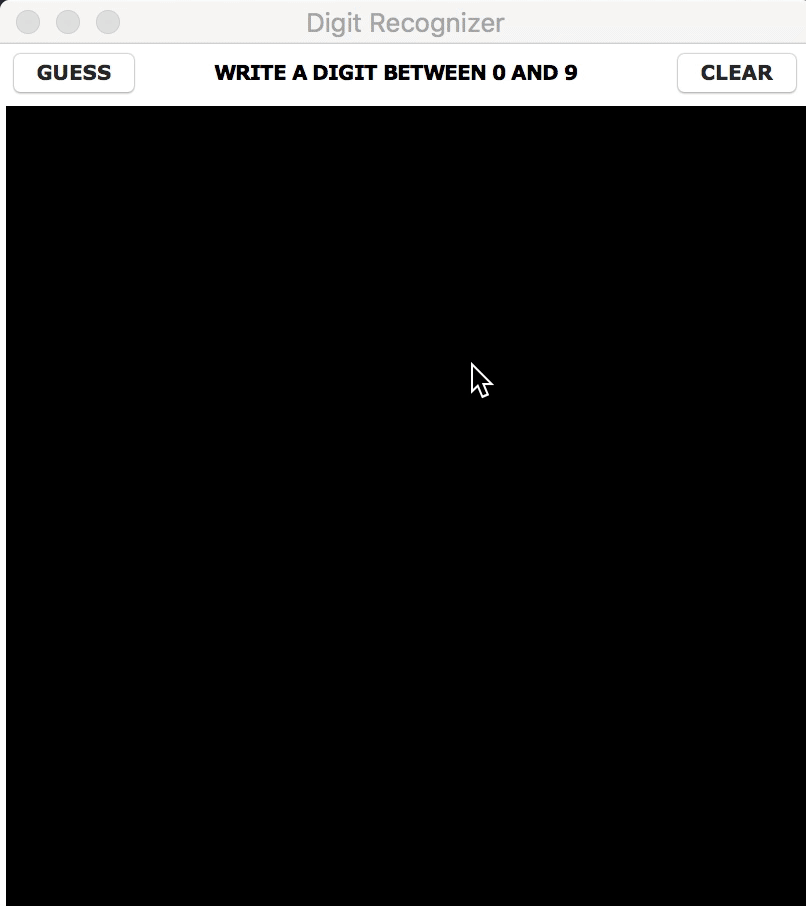

# digit_recognizer  

This is a simple program made with tkinter prompting the user to draw a number.
It then process the image (crop, pad, center, resize) and feed it to a convolutional neural network trained on the mnist dataset.
