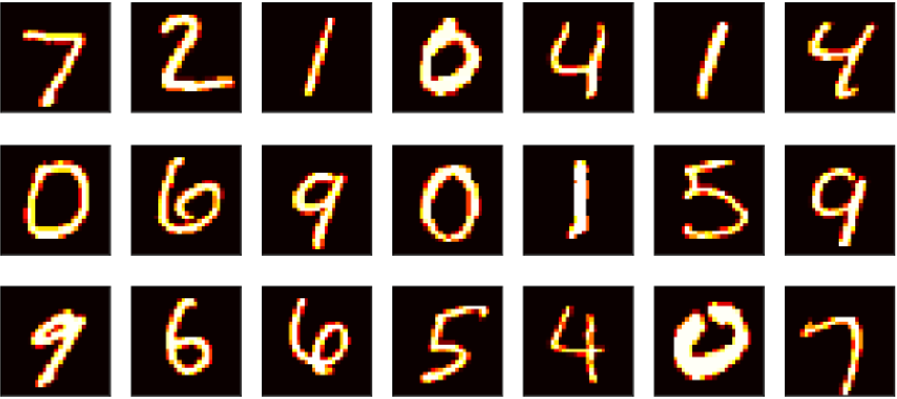

# digit_recognizer  

A simple program made with Tkinter and Keras, it prompts the user to draw a number, process the image (crop, pad, center, resize), and then make a prediction of what it is using a convolutional neural network trained on the mnist dataset.  
  
The mnist dataset is a popular dataset containing 70000 28x28 images of handwritten digits.  
Here is a quick look at some of its instances :  

